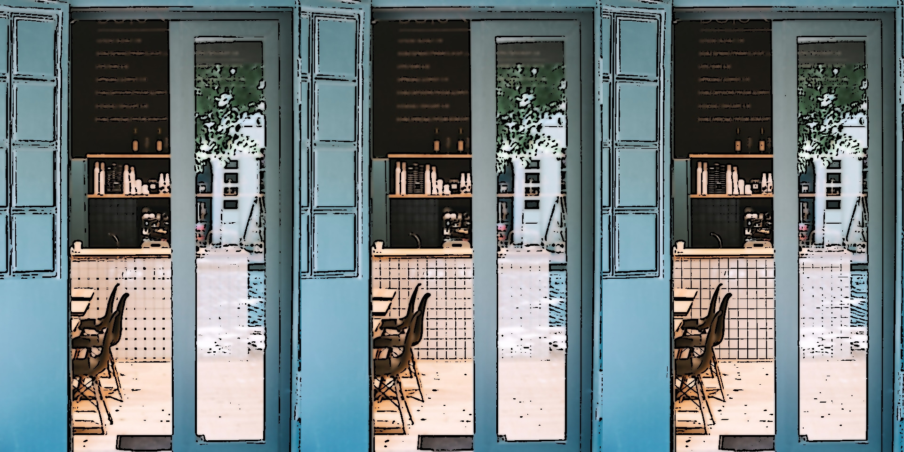
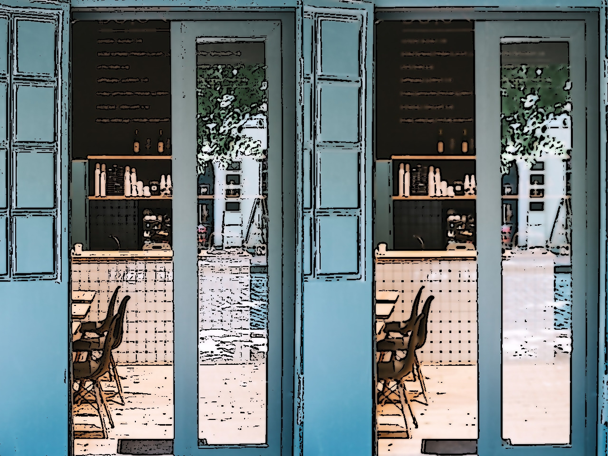
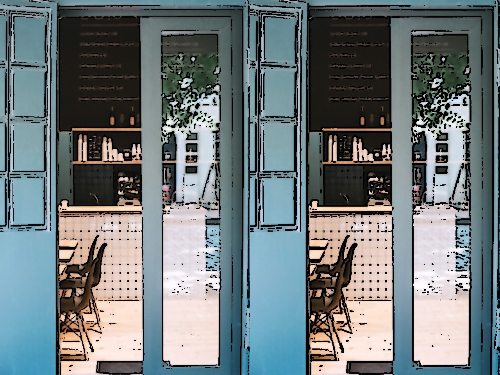
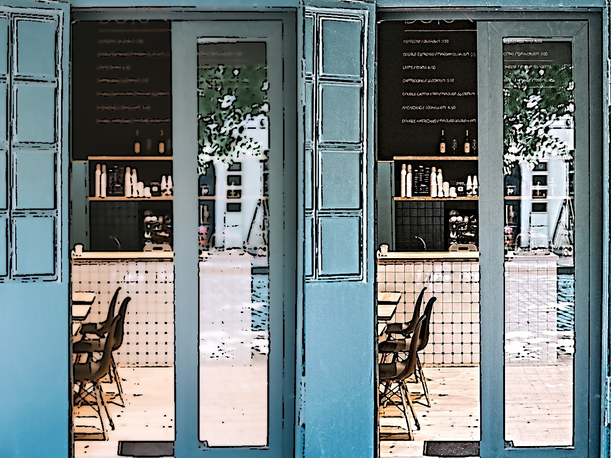

# Pixelate

A programme that lets you experiment with different blurs and filters to achieve different styles of pixelation effects. Built in python using OpenCV and Streamlit.


Table of Contents :bookmark_tabs:
=================
- [Features](#Features)
- [Filter/Effects available](#Filter-and-Effects-available)
- [Installation](#Installation)
- [Deployment](#Deployment)
- [Demo](#demo)
- [Examples](#examples)

## Features

- Live previews
- Cross platform
- Picture/Video input support
- Live webcam input support

## Filter and Effects available

- Median filter
- Gaussian filter
- Bilateral filter
- Laplacian
- Adaptive Thresholding
- Bilateral filter
- Detail enhancing filters
- Erosion
- Colour Quantisation

## Installation

Once the repository is cloned, to install all the python libraries required for cartoonify

```bash
  cd Pixelate
  pip -r requirements.txt
```

ffmpeg is also required which can be installed using 
```bash
  sudo apt-get install ffmpeg
```
## Deployment

To deploy this project run

```bash
  streamlit run pixelate.py
```

Once executed, the project provides a local and network URL that connects it to the port number [8501](http://localhost:8501/) which can be used to connect locally through a web browser.


## Examples

When an image is given as input


When a video is given as input


### Median, Gaussian, Bilateral
  

### Laplacian, Adaptive
  

### With erosion, without erosion
  

### With color quantization, without color quantization
  

### Bilateral, DetailEnhancement
  


### Copyright - ADARSH SANKAR R S (2022)